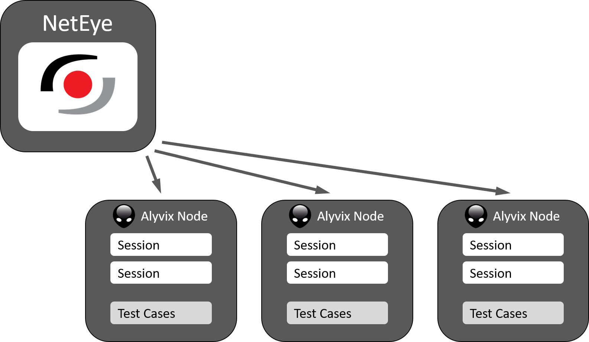

:author: Charles Callaway
:date: 09-01-2023
:modified: 09-01-2023
:tags: integration, monitoring
:lang: en-US
:translation: false
:status: updating

.. include:: ../sphinx-roles.txt

.. _monitoring_integrations_neteye:

####################
NetEye 4 Integration
####################

Alyvix Service fully integrates with
`NetEye  4 <https://neteye.guide/current/introduction/general.html>`_ via the
:ref:`Alyvix Service API <alyvix_service_restful_api_top>`,
allowing you to incorporate your Alyvix nodes into your monitoring network just
as if they were any other server, and see the results of your Alyvix runs
in the standard NetEye 4 dashboards.

This guide will help you configure NetEye 4 so that you can query and
control your Alyvix nodes, check that NetEye and Alyvix are working together properly,
and show you how to use Alyvix to full advantage.

It assumes that you've already correctly
:ref:`installed and configured Alyvix Service <install_top>`
as well as `NetEye <https://neteye.guide/current/getting-started/requirements.html>`_.
As part of that procedure, you will have already copied security certificates
(HTTPS/TLS and JWT) from your NetEye 4 installation to Alyvix Service and restarted
its service on Windows.

So now we're ready to complete the integration/configuration!

.. _monitoring_integrations_neteye_integrate:

=====================
Integration Procedure
=====================

From this point on all our configuration activities will be carried out within
NetEye itself, first on the command line, then within Director, and finally in the
**Alyvix module** that we'll add to NetEye.

As an aside, you can also watch a
`video version of this configuration guide <https://youtu.be/ElP_A9XwwpY>`_.

.. _monitoring_integrations_neteye_configure:

-------------------------
Install the Alyvix Module
-------------------------

First let's use the command line to install the Alyvix module on NetEye.

On your NetEye 4 machine, start a shell as root.  Then run the following two
commands.  It may take several minutes.

.. code-block:: bash
   :caption: Install the Alyvix module
   :class: medium-code-block

   dnf -y groupinstall neteye-alyvix --enablerepo=neteye
   neteye_secure_install

Once it completes, you will need to refresh your browser window, then log out of
NetEye and log back in to ensure the necessary permissions are updated.

.. _monitoring_integrations_neteye_director:

--------------------------------------
Configuring an Alyvix Node in Director
--------------------------------------

Each computer that runs Alyvix Service along with one or more Alyvix test cases is called
an *Alyvix Node*.  From our point of view, a node is simply a dedicated machine running
Alyvix Service and one or more test cases.  From the point of view of NetEye 4, each
Alyvix Node is a *Host* that must be registered as in Director just like any other server.

Thus within NetEye you will need to configure at least the node's host name, type, and
IP address.  Luckily, the registration procedure needs only one very slight modification
`beyond the standard procedure <https://neteye.guide/current/monitoring/configuration-monitored-objects.html#adding-a-host>`_.

Once the Alyvix Module has been installed in the preceding step, an additional section of
properties will be added called "Alyvix settings", containing the field "Alyvix node".
Simply changing the value of this field from "No" to "Yes" is all that's needed to make
the host appear as an Alyvix Node within the Alyvix module.

`Make that change <https://neteye.guide/current/apm/alyvix-configuration.html>`_, then deploy
the modified Director configuration and proceed to the
step below.

.. _monitoring_integrations_neteye_alyvix_module:

-----------------------------------------------
Configuring an Alyvix Node in the Alyvix Module
-----------------------------------------------

Once the deployment is complete, click on the Alyvix module in the left side menu.
It will take you to the screen with the list of Alyvix Nodes.
The final configuration steps, summarized below, are
`described in the NetEye 4 guide <https://neteye.guide/current/apm/alyvix-configuration.html#put-test-case-in-production>`_.

* **Install an Alyvix license on each node**

  To get the license request, go to a node's License tab nd click on the ``Download Request Key``
  button.  This will save a request file to your Downloads folder which you then send to
  info@alyvix.com as an email attachment.  When the activation key is sent back, use the
  ``Upload Activation Key`` button on the License tab to select the key file. |br|

  .. image:: images/install_license.png
     :width: 50%
     :align: center
     :alt: Screenshot of installing an Alyvix license.

  |

* **Add a session to the Alyvix node**

  You can add a session to a node by clicking on the node's row. You can then modify an
  existing session, or create a new one with the ``New Session`` button.  Insert the credentials,
  modify any parameters as needed, and hit the ``Save`` button.  The new session will then
  be displayed and its status updated. |br|

  .. image:: images/add_session.png
     :width: 70%
     :align: center
     :alt: Screenshot of the add session panel.

  |

* **Add a test case to the session**

  Make sure you've created a directory on each node to hold all the test cases.  You'll need
  a copy of all the test cases you want to run on each Alyvix node they should run on.

  To assign an Alyvix test case to our session, click on ``Test Cases`` on the left sidebar menu,
  then on the ``Create`` button to the right.  Give a name for your test case in this session,
  select a test case from the list of test case files in your directory, and confirm with
  the ``Create`` button. |br|

  .. image:: images/add_test_case.png
     :width: 50%
     :align: center
     :alt: Screenshot of the add test case panel.

  |

* **Enable the test case and session to run at regular intervals**

  You can now schedule the test case to run in the workflow at the interval we set.  Whenever
  you add a new session, you'll need to enable both the session workflow itself and the test case.
  It will now run without any further action on our part.  Once added, you can disable and
  re-enable sessions and individual test cases as desired. |br|

  .. image:: images/enable_test_case.png
     :width: 80%
     :align: center
     :alt: Screenshot of enabling a test case or session.

  |

.. _monitoring_integrations_neteye_check:

-------------
A Final Check
-------------

Once your Alyvix sessions are up and running, you'll want to check that they're working
correctly.  Because it takes time to schedule and run Alyvix test cases, results aren't available
instantaneously.

Once each test case completes, Alyvix
`creates a report <https://neteye.guide/current/apm/alyvix-configuration.html#step-5-check-test-case-results>`_
which you can see inside NetEye.  Each report contains both timing data and output screenshots
(both expected and actual in the case of a failed test case run).

Go to the Reports tab and select a test case run from the list.  If the screenshots are
visible and the timing data is present, then you have correctly completed the Alyvix/NetEye
integration and configuration.

  .. image:: images/view_report.png
     :width: 100%
     :align: center
     :alt: Screenshot of a list of reports and one example.
