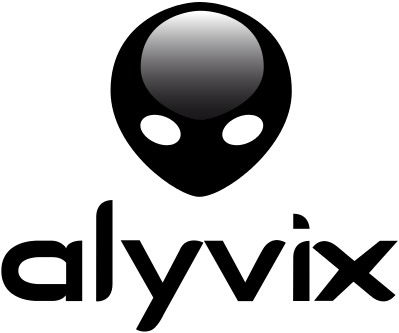

:author: Charles Callaway
:date: 22-09-2020
:modified: 22-09-2020
:tags: stylesheet, guide
:lang: en-US
:translation: false
:status: updating

.. include:: sphinx-roles.txt


.. _style_top:

################
Style Guidelines
################

This document provides the style guide for Alyvix with examples of more advanced features and
their corresponding RST structures, with at least one example of every supported RST feature.

Paragraphs should not have more than four sentences.  Text lines should not be longer than 100
characters except when:

   * A bulleted line is just over 100 characters (e.g., 105)
   * There is a very long sequence with no spaces like a web link
   * There is copied external data like a code block

`See additional Sphinx roles <https://www.sphinx-doc.org/en/1.5/markup/inline.html>`_ not listed below.


.. _style_sections:

******************************
Section and Subsection Headers
******************************

Titles should have English formatting:

   * Capitalize everything except prepositions
   * Should not be more than one line onscreen at widest setting

To improve readability, there should be three blank lines between sections/subsections.  Section
headers should have the character sequence both above and below the title text.  The characters
are (in order):  ``# * = -``

Reference anchors above each section title should grow from left to right as nesting depth
increases.  Because they can be easily broken, they should be changed as infrequently as
possible.  :ref:`See here for linking to them.<style_links+refs>` They look like this:

.. code-block:: bash
   :caption: How to create a linkable section reference
   :class: short-code-block
   :name: _style_section_header_example

   .. _style_sections:

You can use ``-----`` (four or more hyphens) to create a horizontal rule:

-----

And you can add a line of :ref:`blank space <style_break_space>` (like a <br />) with a pipe
character with a blank line both above and below.  Use this sparingly, though, since vertical
space should really be created with CSS.

|


.. _style_bulleted_lists:

************************************************
Bulleted and Enumerated Lists, HList and Columns
************************************************

Bulleted lists should:

   * Always begin with a capital letter and start with the same syntactic type
   * Have the same ending punctuation (either all with `.` or none)
   * Have the same style, e.g. all newspaper headlines vs. all with complete sentences
   * You can also have multi-line bullet points:

        With indented text and images

        .. image:: pictures/alyvix_logo_399x333.png
           :width: 40pt

     And with non-indented text or images

     .. image:: pictures/alyvix_logo_399x333.png
        :width: 40pt

There are also enumerated lists:

   #. Just like bulleted lists
   #. But start them with ``#.``

      #. Subpoints are just like for bulleted lists
      #. But they are numbered

   #. You can start with a number other than 1 by using its number (``4.``) instead of the
      pound sign (``#.``), but it will affect the very first number at top even if put in
      a subpoint

The Alyvix :file:`custom.css` files also supports the ``bignums``, ``bignums-xl`` (with
``onelinelist`` CSS class option) and ``bignums-xxl`` enumerated list styles:

.. rst-class:: bignums

#. Creates white numbers in black circles
#. Can be used together with interface screenshots

This is defined as follows:

.. code-block::
   :class: short-code-block

   .. rst-class:: bignums

   #. Creates white numbers in black circles
   #. Can be used together with interface screenshots

The Alyvix :file:`custom.css` files also supports the ``bignums``, ``bignums-xl`` (with
``onelinelist`` CSS class option) and ``bignums-xxl`` enumerated list styles:


.. rst-class:: bignums-xxl

#. Creates black numbers in grey/white circles and a thick horizontal separator
#. Very useful for step-by-step procedures

|

.. rubric:: Hlist

A horizontal list (``.. hlist::``) has a fixed number of columns but is otherwise like a bulleted
list.    It could be a lot prettier with CSS improvements.

.. hlist::
   :columns: 3

   * Item #1:  |bar-icon|
   * Item #2:  |4arrows-icon|
   * Item #3:  :warn:`:warn:`
   * Item #4:  |if-true|
   * Item #5
   * Item #6
   * Item #7

.. rubric:: Containers -> Columns

You can also create a true text column format by combining the ``.. container::`` role with the
appropriate CSS.  (HTML5 column mode is also possible, but content automatically flows from the
bottom of one column to the top of the other.)

.. container:: twocol

   .. container:: leftside-col

      Lorem ipsum dolor sit amet, consectetur adipiscing elit, sed do eiusmod tempor incididunt
      ut labore et dolore magna aliqua.  Ut enim ad minim veniam, quis nostrud exercitation
      ullamco laboris nisi ut aliquip ex ea commodo consequat.

   .. container:: rightside-col

      .. image:: pictures/alyvix_logo_399x333.png
         :width: 50pt

      Duis aute irure dolor in reprehenderit in voluptate velit esse cillum dolore eu fugiat
      nulla pariatur.  Excepteur sint occaecat cupidatat non proident, sunt in culpa qui officia
      deserunt mollit anim id est laborum.

You may need to manually align the amount of content in each column as sometimes a subsequent
paragraph not in column format will be used to fill out the bottom of the right column.

.. code-block::

   .. container:: twocol

      .. container:: leftside-col

         Text in the left side column

      .. container:: rightside-col

         Text in the right side column

   div.leftside-col {
       width: 47%;
       padding: 0px 3px 0px 0px;
       float: left;
       display: flex;
   }

   div.rightside-col {
       margin-left: 53%;
   }

|

A column-styled menu of icons or images can be made by using a
:ref:`table with no borders <style_columns_via_tables>`.


.. _style_break_space:

******************************
Line Breaks and Vertical Space
******************************

| Write lines with a ``pipe`` character and
| a space on the left side of the text to
| create text with a break in the middle.

.. code-block::
   :class: short-code-block

   | Write lines with a ``pipe`` character and
   | a space on the left side of the text to
   | create text with a break in the middle.

You can also make some empty vertical space just using the pipe character by itself.

.. code-block::
   :class: short-code-block nocopy

   |


.. _style_code_blocks:

*****************************
Code Blocks and File Includes
*****************************

A code block takes the language for the style and keywords, an optional caption that will go in
italics above the block, and an optional link reference.  Sphinx then places the text in a
preformatted HTML block, and uses the `Pygment lexer <https://pygments.org/docs/lexers/>`_
to highlight the text with color according to the language.

The simplest code block just has two colons at the end of one paragraph followed by an indented
paragraph (with a blank line separating them).  It keeps the code block aligned to the left of
the page::

   Simple code blocks only have the default options.

Which looks like this in the .rst file:

.. code-block:: rst
   :name: _style_simple_code_block_example
   :class: short-code-block

   to the left of the page::

      Simple code blocks only have the default options.

As soon as you return to the previous indentation level, the code block (or preformatted section)
will end.  If you want more options, you can use the ``code-block`` directive:

.. code-block:: rst
   :caption: How to create a code block with options
   :class: short-code-block
   :name: _style_code_block_example

   .. code-block:: <language>
      :caption: How to create a code block with options
      :class: short-code-block
      :name: _style_code_block_example

      This is the content of the code block.
      Sometimes it might even be actual code.

When code blocks are used for syntax highlighting, simply put the Pygment code for the programming
language to the right of the directive.  Note that Pygment will first check that the syntax is
valid before adding highlighting!  Bad syntax means the code block appears without highlighting.
The console output will then show something like ``WARNING: Could not lex literal_block as "json".``

You can see `a complete list of languages <https://pygments.org/docs/lexers/>`_ recognized by Pygment.

Here's an example for JSON:

.. code-block:: json
   :class: tiny-code-block
   :emphasize-lines: 4

   { "maps": {
        "map-name":  { } },
     "objects": {
        "<test-case-object-name>":  { } },
     "script": {
        "case":  [ ],
        "sections":  { } }
   }

.. code-block:: rst
   :class: short-code-block

   .. code-block:: json
      :class: tiny-code-block
      :emphasize-lines: 4

      { "maps": {
           "map-name":  { } },
        "objects": {
           "<test-case-object-name>":  { } },
        "script": {
           "case":  [ ],
           "sections":  { } }
      }

The clipboard copy icon is set by default on all code blocks.  To remove it in cases where it
doesn't make sense, add the following class:

.. code-block:: rst
   :class: short-code-block nocopy

   .. code-block::
      :class: nocopy

      Don't put a clipboard copy icon in this code block.

In :file:`custom.css` there are classes available such as ``medium-code-block``,
``short-code-block`` and ``tiny-code-block`` that will narrow the block at preset proportions
(85%, 70% and 50%).

Instead of pasting code into the .rst file, you can also include an entire external file like this:

.. code-block:: rst
   :class: short-code-block
   :caption: Importing the content of the file ``includes.c``

   .. literalinclude:: includes.c
      :language: c
      :linenos:

Note that you can also include a diff of two files by adding the option ``:diff: includes.c.orig``.

Finally, consider the following for directory structures:

.. code-block:: bash
   :class: short-code-block

   .
   ├─── composer.json
   └─── Documentation
        ├─── Index.rst
        ├─── Settings.cfg
        └─── ...


.. _style_custom_roles:

*********************************
Text Properties with Custom Roles
*********************************

You can create a custom role and map it to a custom CSS class in :file:`_static/css/custom.css`,
allowing you to change font color and other properties for selected text within a paragraph.
For example, you can add the following CSS to get a large, fixed green font inheriting other
:guilabel:`Read The Docs` CSS features:

.. code-block:: css
   :class: short-code-block

   .redbold {
       color: red;
       font-weight: bold;
       font-variant: small-caps;
       text-decoration: underline;
    }

At the top of each page where you need this (there is no way to do this globally without changing
or customizing the main RTD template itself), add a new ``Role`` that is tied to the new CSS class
(it can go anywhere in the .rst file):

.. code-block:: rst
   :class: short-code-block

   .. role:: warn
      :class: redbold

You will then be able to use this new ``warn`` role within a paragraph as follows:

.. code-block:: rst
   :class: medium-code-block

   This is some text where we need to say :warn:`Don't` do something!

Which looks like this when you write it out:  "This is some text where we need to say :warn:`Don't`
do something!" :hint:`(You can also make a hint with :hint:)`

Note that you can assign multiple classes when declaring the ``role::`` directive, and you can also
do it with the ``rst-class::`` directive.  Care should be taken as the ordering will affect
which CSS properties are utilized and which are overwritten.

.. code-block:: rst
   :class: short-code-block

   .. rst-class:: bignums-xl
      :class: redbold bluebutton

   .. rst-class:: redbold bluebutton bignums-xl


.. _style_links+refs:

**************************************
Links, Anchors, Aliases and References
**************************************

Link and anchor names must use Python variable syntax.  For automatic link generation, any
punctuation characters will be converted to hyphens in the resulting link index.

You can create a link to an existing anchor, for instance:
:ref:`Getting Started <getting_started_top>`.
Remember to remove the initial underscore from the anchor when you create a link reference.
Also note that if the target of a link doesn't exist, Sphinx will not add that link, but it
will still put the (unlinked) link text there.

.. code-block:: rst

   :ref:`Getting Started <getting_started_top>`

For one-off external links, add an icon to it as in this example:
:iconlink:`ext|Base64|https://en.wikipedia.org/wiki/Base64`

.. code-block:: rst

   :iconlink:`ext|Base64|https://en.wikipedia.org/wiki/Base64`

If instead the link will be reused, try to define it as an *alias* just once using ``:rawhtml:``
in the file :file:`sphinx-roles.txt` in the root directory, e.g.:

.. code-block:: rst

   .. |base64-link| raw:: html

      <a href="https://en.wikipedia.org/wiki/Base64" target="_blank">
      Base64 <i class="fa fa-small fa-external-link"></i></a>


.. rubric:: Aliases

You can create aliases where you want, and use them repeatedly using the ``|<alias>|`` syntax.
It does not matter where on the page you define it; it can even be placed at the bottom of the
page.



The code for the alias:

.. code-block:: rst
   :class: short-code-block
   :caption: Creating an alias for the text string ``|logo|``

   .. |logo| image:: pictures/alyvix_logo_399x333.png
      :align: middle
      :width: 30pt
      :height: 10pt

And then you can reuse it whenever you want:  |logo| |logo| |logo|


.. _style_tables:

******
Tables
******

There are simple, complex, CSV and list-type tables.  You can span multiple columns (even in
simple tables) and indicate a blank cell either with a comment (..) or a backslash (\).

Here is a simple table:

===========  ==========================  =========
Name         Syntax                      Format
-----------  --------------------------  ---------
Italics      \*                          *Italics*
Bold         \**                         **Bold**
Mono         \``                         ``Monospace``
Subscript    a\\ :subscript:\`sub\`      a\ :subscript:`sub`
Superscript  b\\ :superscript:\`super\`  b\ :superscript:`super`
Mixed        \\                          *Ita*\ **Bol**\ ``Lit``\s
Math         \:math:                     :math:`\\\sum_{k=0}^{N-1} s_k`
-----------  --------------------------  ---------
:caps:`Roles defined by Sphinx and DocUtils`
--------------------------------------------------
GUI          Role:guilabel               :guilabel:`File > Settings`
Keys         Role:kbd                    :kbd:`ctrl` + :kbd:`s`
File         Role:file                   :file:`/etc/passwd`
-----------  --------------------------  ---------
:caps:`Roles defined by in-page directives (sphinx-roles.txt) and custom.css`
--------------------------------------------------
Warn         Role:warn                   :warn:`Warn`
Hint         Role:hint                   :hint:`Hint`
SmallCaps    Role:caps                   :caps:`CamelCase`
===========  ==========================  =========

This is built as follows::

   =========  =============  =========
   Name       Syntax         Format
   --------  --------------  ---------
   Italics    \*             *Italics*
   Bold       \**            **Bold**
   Mono       \``            ``Monospace``
   Mixed      \\             *Ita*\ **Bol**\ ``Lit``\s
   Math       \:math:        :math:`\\\sum_{k=0}^{N-1} s_k`
   ---------  -------------  ---------
   :caps:`Roles defined by Sphinx`
   -----------------------------------
   GUI        Role:guilabel  :guilabel:`File > Settings`
   Keys       Role:kbd       :kbd:`ctrl` + :kbd:`s`
   File       Role:file      :file:`/etc/passwd`
   ---------  -------------  ---------
   :caps:`Roles defined by in-page directives (sphinx-roles.txt) and custom.css`
   -----------------------------------
   Warn       Role:warn      :warn:`Warn`
   Hint       Role:hint      :hint:`Hint`
   SmallCaps  Role:caps      :caps:`CamelCase`
   =========  =============  =========


**Note:** ``sphinx-build`` will complain if there is text in between the defined columns (but not
if it sticks out the right hand side).

And here is a complex table:

+------------------------+------------+----------+----------+
| Header row, column 1   | Header 2   | Header 3 | Header 4 |
| (header rows optional) |            |          |          |
+------------------------+------------+----------+----------+
| body row 1, column 1   | column 2   | column 3 | column 4 |
+------------------------+------------+----------+----------+
| body row 2             | ...        | ...Spanning text... |
+------------------------+------------+----------+----------+

Built like so::

   +------------------------+------------+----------+----------+
   | Header row, column 1   | Header 2   | Header 3 | Header 4 |
   | (header rows optional) |            |          |          |
   +------------------------+------------+----------+----------+
   | body row 1, column 1   | column 2   | column 3 | column 4 |
   +------------------------+------------+----------+----------+
   | body row 2             | ...        | ...Spanning text... |
   +------------------------+------------+----------+----------+


Column widths and `other modifiers <https://docutils.sourceforge.io/docs/ref/rst/directives.html#tables>`_
can be specified if you use the full table environment:  align (left, center, right), widths
(auto, grid, list=100%) and width (current line width).

.. table:: (Optional table title)
   :widths: 60 40
   :width: 75
   :align: right

   +-------------+---------------------+
   | Color       | Description         |
   +-------------+---------------------+
   | Green       | Leaves on the trees |
   +-------------+---------------------+

|
|
|
|
|
|

.. code-block:: rst
   :class: medium-code-block

   .. table:: (Optional table title)
      :widths: 60 40
      :width: 75
      :align: right

      +-------------+---------------------+
      | Color       | Description         |
      +-------------+---------------------+
      | Green       | Leaves on the trees |
      +-------------+---------------------+

|

.. _style_columns_via_tables:

Here's an example of columns via a table having a *class* that removes borders

.. table::
   :widths: 33 33 33
   :class: table-empty-no-borders

   +---------+---------+---------+
   | Item A1 | Item B1 | Item C1 |
   +---------+---------+---------+
   | Item A2 | Item B2 | Item C2 |
   +---------+---------+---------+
   | Item A3 | Item B3 | Item C3 |
   +---------+---------+---------+

.. code-block:: rst
   :class: medium-code-block

   .. table::
      :widths: 33 33 33
      :class: table-empty-no-borders

      +---------+---------+---------+
      | Item A1 | Item B1 | Item C1 |
      +---------+---------+---------+
      | Item A2 | Item B2 | Item C2 |
      +---------+---------+---------+
      | Item A3 | Item B3 | Item C3 |
      +---------+---------+---------+

And the same table with the *table-body-no-borders* class applied:

.. table::
   :widths: 33 33 33
   :class: table-body-no-borders

   +---------+---------+---------+
   | Item A1 | Item B1 | Item C1 |
   +---------+---------+---------+
   | Item A2 | Item B2 | Item C2 |
   +---------+---------+---------+
   | Item A3 | Item B3 | Item C3 |
   +---------+---------+---------+

|


.. _style_images:

*************************
Images, Figures and Icons
*************************

There are a number of options for images, such as resizing and placement.  Using the ``:align:``
keyword will allow text to wrap around the sides; to place an image on the left side without
allowing wrapping on the right, just leave out the parameter altogether.  Clicking on the image
in the browser will load the image by itself into the browser window.


This is built as follows:

.. code-block:: rst
   :class: short-code-block
   :caption: How to include a simple image
   :name: _style_image_example

   .. image:: pictures/alyvix_logo_399x333.png
      :width: 200px
      :align: center
      :height: 100px
      :alt: This is alternate text.

You can add shadows and other effects by adding a specific CSS class to :file:`custom.css`
as follows (note that figures and images have different options):

.. code-block:: rst
   :class: short-code-block

   .. image:: pictures/alyvix_logo_399x333.png
      :class: image-boxshadow

You can also make a more structured figure.  It assumes you want an image at the top with the
basic options above.  A paragraph at the same indentation level as the options will be treated as
a caption, and any additional indented structures will be treated as a figure legend.

You can set an empty caption by using the standard ``..`` paragraph comment.  but can also put an
entire (indented) RST structure within the figure space.  You can add the class ``:class: outline``
to the figure declaration and :file:`custom.css` will add a thin-lined box around the entire thing:


   Fig. 1:  The indented structure becomes like a caption.

.. code-block:: rst
   :class: medium-code-block

   .. figure:: pictures/alyvix_logo_399x333.png
      :class: outline
      :scale: 40 %
      :align: center
      :alt: This is alternate text.
      :figwidth: 50 %
      :target: http://docutils.sourceforge.net/docs/ref/rst/directives.html#figure

      Fig. 1:  The indented structure becomes like a caption.

When using the ``:target:`` parameter, internal paths should have the following format so that
they work both on a local copy and on the hosted site:

.. code-block:: rst
   :class: short-code-block

   :target: ../_images/<filename>.png

Some support for figure numbering is available:  Add the line ``numfig = True`` to :file:`conf.py`
and then before the figure add the line ``.. _label_fig1:``, and then the reference
``:refnum:`label_fig1`` where needed in the text.  Unfortunately for now, it inserts an HTML
link along with the number (see also ``numfig_format`` and ``numfig_secnum_depth``), and
the numbering starts over again within each subsection, and these aren't numbered.

(Automatic section numbering is also possible with an extension to Sphinx:
http://docutils.sourceforge.net/docs/ref/rst/directives.html#automatic-section-numbering)

For general `Font Awesome <https://fontawesome.com/icons?d=gallery>`_ icons, use the ``fa`` directive:

.. rst-class:: fa fa-check

   With text, or use the ``|`` by itself for just the icon

Just append ``fa-`` to the name of the Font Awesome icon you want (or use the notation in the
*sphinx-panels* extension at the bottom of this page):

.. code-block:: rst

   .. rst-class:: fa fa-check

      With text, or use the ``|`` by itself for just the icon (it's always placed as ``::before``)

Note that only **free** icons are available, and that there is a difference between FA version
4 and FA version 5.

A single inline icon is also possible by adding ``fa-small`` as long as it's at the start of a
sentence/bullet:

.. rst-class:: fa fa-small fa-play-circle

   I'm a ``play-circle`` Font Awesome icon

Some Font Awesome icons have predefined roles:

+----------+--------------------------+----------------------+
| Icon     | Usage                    | Appearance           |
+----------+--------------------------+----------------------+
| Download | \:download\:\`file.txt\` | :download:`file.txt` |
+----------+--------------------------+----------------------+

.. note::

   On compilation, Sphinx will check that the file actually exists at the path specified.

Don't use RAW HTML to do it (unless required to circumvent the above to restrictions, but even
then think hard about it due to the security concerns of raw HTML):

.. raw:: html

   <i class="fa fa-inbox"></i>

.. code-block:: rst
   :class: short-code-block

   .. raw:: html

      <i class="fa fa-inbox"></i>

Here's a naughty example of using a role directive to pass through raw HTML to create an
:rawhtml:`<i class="fa fa-small fa-plane"></i>` airplane icon.


.. _style_info_boxes:

*****************************************************
Info Boxes, Pull Quotes, Topics, Rubrics and Sidebars
*****************************************************

.. note::   This is a `note` style of info box.  It can contain bulleted lists and other formatting.

The titles are fixed in CSS with the ``::before`` property.

.. warning::
   The `warning` style of info box has different colors.

The other box types are:  ``admonition``, ``attention``, ``caution``, ``danger``, ``error``,
``hint``, ``important``, ``seealso`` and ``tip``.

The :file:`custom.css` file allows you to pass a class name to make it less than full width:

.. danger::
   :class: short-admonition

   A short **Danger** box

.. code-block:: rst
   :class: short-code-block

   .. danger::
      :class: short-admonition

      A short **Danger** box

The *right-short-admonition* class does the same but aligns the shortened box to the right column.

.. hint::
   :class: right-short-admonition

   A right-aligned, short **Hint** box

.. code-block:: rst
   :class: short-code-block

   .. danger::
      :class: right-short-admonition

      A right-aligned, short **Hint** box


.. rubric:: Epigraphs and Pull Quotes

Additional styles like ``epigraph`` and ``pull-quote`` can be tied to specific CSS classes
with those names.

.. epigraph::

   A test epigraph

.. pull-quote::

   “Followed by a test pull-quote„

.. code-block::

   .. pull-quote::

      “Followed by a test pull-quote„

A **topic** creates a simple box with a title above it.  In some themes, like the sphinx_rtd
theme, it just creates this HTML structure, which is mapped to the CSS class *topic*:
``<div class="topic"><p class="topic-title first">Title</p><p>Box content</p></div>``


.. rubric:: Rubric Titles

Here is the content of the rubric (topic box), for when you need a section with title that
shouldn't be included in the index (e.g., it's too small).  Note the restyled horizontal scrollbar
coded in CSS.

.. code-block:: rst
   :class: short-code-block
   :caption: How you can create a topic box
   :name: _style_topic_example

   .. rubric:: Rubric Titles

   Here is the content of the rubric (topic box), for when you need a section with title that
   shouldn't be included in the index (e.g., it's too small).  Note the restyled horizontal
   scrollbar coded in CSS.

.. rubric:: Rubric Titles

Rubrics are like Topics, but don't require indentation for the first paragraph, and in the
current CSS have a smaller font.

.. centered:: A Centered Title (using ``.. centered::``)

This is like a topic or rubric, but centered.

.. rubric:: Sidebar Title

A **sidebar** creates a box that floats to the left.  Other elements will tend to wrap around it
(not recommended for tablets or smartphones).

.. sidebar:: Sidebar Title
   :subtitle: *Optional Sidebar Subtitle*

   Subsequent indented lines comprise the body of the sidebar.  You can put any kind of block
   elements inside of it.

This is built as follows:

.. code-block:: rst
   :caption: How to create a sidebar to the right
   :class: short-code-block
   :name: _style_sidebar_example

   .. sidebar:: Sidebar Title
      :subtitle: *Optional Sidebar Subtitle*

      Subsequent indented lines comprise the body of
      the sidebar.  You can put any kind of elements
      inside of it.


.. _style_comments:

********
Comments
********

Comments are not visible in the rendered document.  See?  No comment visible here:

.. This is a comment that will not be included.

The above comment appears this way in the source file:

.. code-block:: bash
   :class: short-code-block

   .. This is a comment that will not be included.

You can even comment entire sections by indenting appropriately under a comment.


.. _style_raw_html:

**************
Using Raw HTML
**************

If necessary, straight HTML can be inserted into the guide.  It's not needed for block elements,
since they can have custom classes and thus custom CSS.  Sometimes it may be necessary for third
party plugins (video, twitter,  instance with third party Note there are several problems,
though:

   * It's a potential security hole
   * It reduces portability
   * You can't put :ref:`aliases (macro substitution)<style_links+refs>` inside it
   * For goodness sake, don't put custom CSS in it, just link it to a custom CSS class in the
     Sphinx template

Here are some examples:

.. raw:: html

   <ul><li>
   Press the <kbd style="background-color: rgba(62,155,161); color: #fff; font-weight: 400; padding-left: 6px; padding-right: 6px; border-style: none; border-radius: 7px;">Enter</kbd> key.
   </li><li>
   <kbd style="background-color: #eee; color: #000; font-weight: 600; padding: 1px 3px 1px 3px; margin: 0px 2px 0px 2px; border-style: solid; border-radius: 6px; border-width: 1px; border-color: rgba(74,158,154);">Network</kbd>
   </li><li>
   <code style="background-color: rgba(74,158,154); color: #fff; font-weight: 500; padding: 1px 4px 1px 4px; border-style: none;">Add</code>
   </li><li>
   <code style="background-color: white; color: #000; font-weight: 500; padding: 0px 3px 1px 3px; margin: 0px 1px 0px 1px; border-style: solid; border-width: 1px; border-color: rgba(230,230,230); white-space: nowrap;">Add Map</code>
   </li><li>
   <code style="color: rgba(74,158,154); background-color: #fff; font-weight: 400; padding: 1px 2px 1px 4px; border-style: none;">Allow viewing of all logs</code>
   </li><li>
   <kbd style="background-color: rgb(252,252,252);border-color: rgb(204,204,204);border-style: solid;border-width: 1px;border-radius: 3px;box-shadow: rgb(187,187,187) 0px -1px 0px 0px inset;color: rgb(85,85,85);display: inline;font-family: Consolas, Menlo, Courier;font-weight: 400;overflow-wrap: break-word;padding: 3px 5px 3px 5px;vertical-align: middle;">Test + Text pqj</kbd>
   </li></ul>

And don't forget that you can :ref:`alias and reuse <style_links+refs>` all of these:

.. |enterkey| raw:: html

   <kbd style="background-color: rgba(62,155,161); color: #fff; font-weight: 400; padding-left: 6px; padding-right: 6px; border-style: none; border-radius: 7px;">Enter</kbd>

Like pressing the |enterkey| key many times:  |enterkey| |enterkey| |enterkey|

.. code-block::

   .. |enterkey| raw:: html

      <kbd style="background-color: rgba(62,155,161); color: #fff; font-weight: 400; padding-left: 6px; padding-right: 6px; border-style: none; border-radius: 7px;">Enter</kbd>


.. _style_sphinx_extensions:

*************************************
Sphinx and Optional Sphinx Extensions
*************************************

The required Python modules (we recommend you install them via *pip*) for building the
documentation are:

* ``sphinx``
* ``sphinx_rtd_theme``
* ``sphinx-copybutton``

We typically build the user guide with the following command.  You will need to change the
executable and source/build directory names according to your environment.

.. code-block::
   :class: nocopy

   > C:\Python37\python.exe -m sphinx.__main__ -E -a -b html C:\projects\alyvix_doc C:\projects\alyvix_doc\_build

The extensions below can be installed as desired.  Only the copy/accordion button extension
is included by default in this repository.


.. _style_sphinx_iconlink:

=============================
The Custom IconLink Extension
=============================

The IconLink extension (included by default) standardizes a single format for
:ref:`links <style_links+refs>` that are external, that should have the link be placed on an icon
rather than a text string, or both.  Here's a prototype and two examples:

.. code-block::
   :class: nocopy

   :iconlink:`type|link text|URL`

   :iconlink:`ext|The OpenCV project|https://opencv.org/`
   :iconlink:`video||http://youtu.be/KnQT7U8Fxoo`

Each instance consists of three arguments separated by vertical bars " | ":

* :bolditalic:`type` -- Selects the (free) `Font Awesome <https://fontawesome.com/icons?d=gallery>`_
  icon to use and various HTML/CSS attributes, along with the browser tab behavior:

  .. table::
     :widths: 15 30 20 35

     +----------+-------------------------------------------------+---------+-----------------------------------------------------+
     | Type     | Example with Icon                               | New Tab | RST encoding                                        |
     +----------+-------------------------------------------------+---------+-----------------------------------------------------+
     | External | :iconlink:`ext|external link|stylesheet.html`   | Yes     | ``:iconlink:`ext|external link|stylesheet.html```   |
     +----------+-------------------------------------------------+---------+-----------------------------------------------------+
     | Glossary | :iconlink:`gloss|glossary link|stylesheet.html` | No      | ``:iconlink:`gloss|glossary link|stylesheet.html``` |
     +----------+-------------------------------------------------+---------+-----------------------------------------------------+
     | Video    | :iconlink:`video|video link|stylesheet.html`    | No      | ``:iconlink:`video|video link|stylesheet.html```    |
     +----------+-------------------------------------------------+---------+-----------------------------------------------------+
     | Pivotal  | :iconlink:`pivotal||174064572`                  | Yes     | ``:iconlink:`ext||174064572```                      |
     +----------+-------------------------------------------------+---------+-----------------------------------------------------+

* :bolditalic:`link text` -- The string to display on the web page wrapped in the ``href`` HTML
  tag.  If the link text is empty, only the icon will appear.

* :bolditalic:`URL` -- The URL to use as the link in the HTML ``href`` attribute

The extension itself is stored in the repository as the single file
:file:`alyvix_doc\\_ext\\iconlink.py`.  The icon used can be changed in this python file, while
the appearance can be changed in :file:`allyvix_doc\\_static\\css\\custom.css`.

While this extension is included by default, it does require one change in the DocUtils file
:file:`Python\\Lib\\site-packages\\docutils\\writers\\_html_base.py` to ensure the icon CSS
and class parameters are appropriately inserted.  Simple replace the following function in that
file with this version:

.. code-block::

   def visit_emphasis(self, node):
       icon = node.attributes.get('class')
       if icon is None: icon = ''
       self.body.append(self.starttag(node, 'em', CLASS=icon))


.. _style_sphinx_copybutton:

==================================
Dynamic Copy and Accordion Buttons
==================================

This extension to Sphinx's ``sphinx-copybutton`` extension improves the usability of the
copy-to-clipboard function for code blocks and adds accordion buttons.  To use it:

* Install the extension with ``pip install sphinx-copybutton``
* Add ``'sphinx_copybutton'`` to the extension list in Sphinx's :file:`conf.py`

Then modify the file :file:`Python37/Lib/site-packages/sphinx_copybutton/static/copybutton.js_t`
to allow disabling the copy button for a code block by adding ``:class: nocopy`` to the RST
directive, and to filter out command prompts when copying from code blocks.  In that file you'll
need to modify these parts as shown below:

* Change the English messages at the top
* Replace the ``addCopyButtonToCodeCells`` function
* Replace the ``copyTargetText`` function
* Add and call the ``addButtonToAccordionCells`` function

.. code-block:: js

   const messages = {
     'en': {
       'copy': 'Copy to clipboard',
       'copy_to_clipboard': 'Copy to clipboard',
       'copy_success': 'Copied',
       'copy_failure': 'Failed to copy',
     },

.. code-block:: js

   const addCopyButtonToCodeCells = () => {
     // If ClipboardJS hasn't loaded, wait a bit and try again. This
     // happens because we load ClipboardJS asynchronously.
     if (window.ClipboardJS === undefined) {
       setTimeout(addCopyButtonToCodeCells, 250)
       return
     }

     // Add copybuttons to all of our code cells
     const codeCells = document.querySelectorAll('{{ copybutton_selector }}')
     codeCells.forEach((codeCell, index) => {
       const id = codeCellId(index)
       codeCell.setAttribute('id', id)
       const pre_bg = getComputedStyle(codeCell).backgroundColor;

       const clipboardButton = id =>
       `<a class="copybtn o-tooltip--left" style="background-color: ${pre_bg}" data-tooltip="${messages[locale]['copy']}" data-clipboard-target="#${id}">
         
       </a>`
       grandparent = codeCell.parentElement.parentElement;  // Line added by Charles@WP  ---  Don't add a copy button when the code block doesn't want it
       if ((grandparent.getAttribute('class') == null) || (grandparent.getAttribute('class').search('nocopy') < 0)) {  // Conditional added by Charles@WP
           codeCell.insertAdjacentHTML('afterend', clipboardButton(id))
       }
     })

.. code-block:: js

   var copyTargetText = (trigger) => {
     var target = document.querySelector(trigger.attributes['data-clipboard-target'].value);
     var textContent = target.textContent.split('\n');
     if (textContent[0].startsWith('C:\\> ')) { return textContent[0].slice(5); } // Line added by Charles@WP
     if (textContent[0].startsWith('C:\\Alyvix\\testcases> ')) { return textContent[0].slice(21); } // Line added by Charles@WP
     textContent.forEach((line, index) => {
       if (line.startsWith(copybuttonSkipText)) {
         textContent[index] = line.slice(copybuttonSkipText.length)
       }
     });
     return textContent.join('\n');
   }

And the accordion-style expand/contract buttons are here as well since they use the same DOM
approach as the copy buttons:

.. code-block:: js

   const addButtonToAccordionCells = () => {
     // Add accordion buttons to all classes containing the 'accordion' class
     const accordionCells = document.querySelectorAll('button.accordion')
     accordionCells.forEach((accordionCell, index) => {
       accordionCell.parentNode.replaceWith(accordionCell)
       accordionCell.addEventListener("click", function() {
         this.classList.toggle("active");
         var panel = this.nextElementSibling;
         if (panel.style.display === "block") { panel.style.display = "none"; }
         else { panel.style.display = "block"; }
       });
     })
   }
   runWhenDOMLoaded(addButtonToAccordionCells)


Also add the accordion CSS class to the file
:file:`Python37/Lib/site-packages/sphinx_copybutton/static/copybutton.css`:

.. code-block:: css

   button.accordion {
       background-color: rgb(41,128,185);
       color: #fff;
       cursor: pointer;
       padding: 7px 14px;
       width: 94%;
       border: none;
       align: center;
       text-align: left;
       outline: none;
       margin-top: 10px;
   }

|


.. _style_sphinx_panels:

=============
Sphinx Panels
=============

The `Sphinx Panels extension <https://sphinx-panels.readthedocs.io/>`_ adds the following features:

* Card panels
* Tabbed panels
* Button style links that can also serve as links for a whole panel
* Dropdown boxes that can hide content like FAQ answers
* Github `Octicons <https://primer.style/octicons/>`_ and improved
  `FontAwesome <https://fontawesome.com/icons?d=gallery>`_ support

------
Badges
------

Let's start with the simplest first, **badges**, a kind of text version of the GitHub repo
status badge:

.. tabbed:: Appearance

   :badge:`primary,badge-alyvix-primary`  :badge:`secondary,badge-secondary badge-pill`

.. tabbed:: RST code

   .. code-block:: rst

      :badge:`primary,badge-alyvix-primary`
      :badge:`secondary,badge-secondary badge-pill`

-----------
Card Panels
-----------

**Card panels** are containers that use Bootstrap to size and position themselves appropriately (see
the linked page above for additional formatting options):

.. tabbed:: Appearance

   .. panels::

      Panel #1
      ^^^^^^^^

      :badge:`badge1,badge-alyvix-primary`
      :badge:`New!,badge-warning`

      ---

      Panel #2

      A link to :link-badge:`https://www.alyvix.com/,"Alyvix",tooltip=A Tooltip` with tooltip

      ---
      :body: text-center

      Panel #3

      ++++++++++
      * List #3A
      * List #3B

      ---

      Panel #4
      ^^^^^^^^

      .. dropdown:: :fa:`arrow-circle-right` Panel #4 Button

         Hidden content

      There's hidden content above me

      ---
      :img-top: pictures/alyvix_logo_399x333.png

      Panel #5 with Image at Top

      .. dropdown:: Panel #5 Button

         The content below is a *link-button*:

         .. link-button::  https://www.alyvix.com
            :text: www.alyvix.com
            :classes: bluebutton

.. tabbed:: RST code

   .. code-block:: rst

      .. panels::

         Panel #1
         ^^^^^^^^

         :badge:`badge1,badge-alyvix-primary`
         :badge:`New!,badge-warning`

         ---

         Panel #2

         A link to :link-badge:`https://www.alyvix.com/,"Alyvix",tooltip=A Tooltip` with tooltip

         ---
         :body: text-center

         Panel #3

         ++++++++++
         * List #3A
         * List #3B

         ---

         Panel #4
         ^^^^^^^^

         .. dropdown:: :fa:`arrow-circle-right` Panel #4 Button

            Hidden content

         There's hidden content above me

         ---

         Panel #5 with Image at Top

         .. dropdown:: Panel #5 Button

            The content below is a *link-button*:

            .. link-button::  https://www.alyvix.com
               :text: www.alyvix.com
               :classes: bluebutton

-------------
Tabbed Panels
-------------

**Tabbed panels** (used to show the RST code above) let you overlay multiple content elements
in the same space, allowing the user to choose which one to see.  You can use the ``:new-group:``
parameter after a new tab to start a new set of tabbed panels, ``:selected:`` to select a default
tab, and ``:class-label:`` and ``:class-content:`` among other formatting options.

We've changed the default blue color in tab panels to match our Alyvix blue, which
is done by setting the appropriate variable in ``panels_css_variables`` in
:file:`conf.py`.

.. tabbed:: Tab #1 (Appearance)
   :class-label: smallcaps
   :class-content: redbold

   Text in tab panel #1

.. tabbed:: Tab #2 (RST code)

   .. code-block:: rst

      .. tabbed:: Tab #1 (Appearance)
         :class-label: smallcaps
         :class-content: redbold

         Text in tab panel #1

------------
Link Buttons
------------

**Link buttons** let you easily create a button linking to a URL, including making an entire panel
part of the link.  (Watch out if adding the *stretched-link* CSS element which can make your entire
page a link.)  Some examples:

.. link-button:: style_sphinx_panels
   :type: ref
   :text: Link to the Sphinx Panels section
   :classes: btn-success

.. code-block:: rst

   .. link-button:: sphinx/panels
      :type: ref
      :text: Link to the Sphinx Panels section
      :classes: btn-success


.. tabbed:: Simple Button with Tooltip

   .. link-button:: https://www.alyvix.com/
      :classes: btn-success
      :type: url
      :text: Link to Alyvix
      :tooltip: I go to Alyvix

   .. code-block:: rst

      .. link-button:: https://www.alyvix.com/
         :classes: btn-success
         :type: url
         :text: Link to Alyvix
         :tooltip: I go to Alyvix

.. tabbed:: Default Tab
   :selected:

   .. link-button:: https://www.alyvix.com/
      :type: url
      :text: Another link to Alyvix
      :tooltip: I also go to Alyvix
      :classes: btn-alyvix-outline-primary btn-block

   .. code-block:: rst

      .. link-button:: https://www.alyvix.com/
         :type: url
         :text: Another link to Alyvix
         :tooltip: I also go to Alyvix
         :classes: btn-alyvix-outline-primary btn-block

--------
Dropdown
--------

A **dropdown** creates a hidden box of content which is initially invisible.  When the user clicks
on the button, space is added below the button and filled with that content.  Clicking a second
time makes it disappear again.  You can use the ``:animate:`` keyword and the ``fade-in`` or
``fade-in-slide-down`` values on the content in the box.

.. tabbed:: Appearance

   .. dropdown:: :fa:`eye` Bottom-left panel
      :animate: fade-in-slide-down
      :container: + shadow
      :title: bg-alyvix-primary text-white font-weight-bold

      Hidden content

      Hidden content

      Hidden content


.. tabbed:: RST code

   .. code-block:: rst

      .. dropdown:: :fa:`eye` Bottom-left panel
         :animate: fade-in-slide-down
         :container: + shadow
         :title: bg-alyvix-primary text-white font-weight-bold

         Hidden content

         Hidden content

         Hidden content

----------
Font Icons
----------

**Font icons**, whether Github's *Octicons* or the more traditional Font Awesome icons, are now
supported with *RST directives*, although you will probably need to add CSS to the
:file:`css/custom.css` file:

.. tabbed:: Appearance

   Octicon (screen-full): |halftab| :opticon:`screen-full,,size=16` |tab|
   FA (bars): |halftab| :fa:`bars,fa-small` |tab|
   Octicon (x-circle): |halftab| :opticon:`x-circle,text-white bg-danger,size=24`

.. tabbed:: RST code

   .. code-block:: rst

      Octicon (screen-full): |halftab| :opticon:`screen-full,,size=16` |tab|
      FA (bars): |halftab| :fa:`bars,fa-small` |tab|
      Octicon (x-circle): |halftab| :opticon:`x-circle,text-white bg-danger,size=24`

**Note** that although they are called *Octicons*, the sphinx-panel RST role calls them *Opticons*.

|


.. _style_sphinx_potential:

***************************************
Optional Sphinx Extensions and HTML/CSS
***************************************


.. _style_sphinx_graphviz:

========
Graphviz
========

`Graphviz <https://www.sphinx-doc.org/en/1.7/ext/graphviz.html>`_ has several requirements that
must be satisfied before it can be used:

* Downloaded and installed on the machine running the Sphinx build process
* Add ``'sphinx.ext.graphviz'`` to the extension list in Sphinx's :file:`conf.py`
* Add an additional build option with the path where GraphViz is installed, e.g.:
  ``-D graphviz_dot="C:\Program Files (x86)\Graphviz2.38\bin\dot.exe"``
* As this is a natively supported extension, no ``pip install`` command is necessary

Note that the ``:class:`` parameter currently doesn't work, so any additional elements will have
to be added in custom.css on the default `graphviz` class.  For styling internal elements like
the background color (GraphViz supports RGBA and named colors), you will need to pass those as
arguments to GraphViz itself.  Remember that GraphViz passes back a dynamically generated *png*
file like :file:`_images/graphviz-3834087134ab82.png`, so you can't change anything internally
if it's not in the specification.

.. code-block:: bash
   :class: short-code-block

   .. graphviz::
      :alt: alt-text
      :align: center
      :caption: graphviz-caption
      :class: gv-background

      digraph foo {
         bgcolor="#fcfcfc00"
         "bar" -> "baz";
      }

   .graphviz {
       padding: 5px;
   }

|


.. _style_sphinx_youtube:

=======================
Embedded YouTube Videos
=======================

Add a YouTube video specifying the whole URL or just the code.  We have tested this with no
problems, but currently have decided not to embed videos, so we use thumbnails to external
links instead.

* Install in Python with ``pip install sphinxcontrib.youtube``
* Add ``'sphinxcontrib.youtube'`` to the extension list in Sphinx's :file:`conf.py`

Usage examples:

.. code-block:: rst

   .. youtube:: http://www.youtube.com/watch?v=Qef7ExMoPz8

   .. topic:: An Embedded Video

      .. youtube:: Qef7ExMoPz8


Note that we currently modify the default files to change the CSS and use the proper HTML:
:file:`Python37/Lib/site-packages/sphinxcontrib/youtube/youtube.py`

.. code-block:: python

   def visit(self, node):

       video_id = get_video_id(node.url)

       url = u'//www.youtube.com/embed/{0}?feature=player_detailpage'.format(video_id)

       tag = u'''<div class="section" id="youtube-videos"><iframe src="https://www.youtube.com/embed/{0}" style="border: 0; height: 345px; width: 560px">
     </iframe></div>'''.format(video_id)

       self.body.append(tag)

|


.. _style_sphinx_pdf:

==============
PDF Conversion
==============

The following steps are required:

* Install via ``pip install rst2pdf``
* Add ``'rst2pdf.pdfbuilder'`` to the extension list in Sphinx's :file:`conf.py`
* Add a new build command with the path where GraphViz is installed, e.g.:
  ``-E -a -b pdf C:\projects\alyvix_doc C:\projects\alyvix_doc\_build``

The result will be a file called :file:`Python.pdf` in the :file:`_build` directory.  The
quality isn't that great, but it's complete (including the todo's even when they are turned off).

Note that as of February 2020, Rinoh (``pip install rinohtype``) is not working in Python 3.7.


.. _style_sphinx_htmlcss:

===================================
Potential HTML and CSS Integrations
===================================


--------------------
Scroll-to-Top Button
--------------------

.. raw:: html

   <button onclick="topFunction()" id="topButton" title="Go to top">Top</button>

.. code-block:: rst

   .. raw:: html

      <button onclick="topFunction()" id="topButton" title="Go to top">Top</button>


---------------------------
Text Superimposed on Images
---------------------------

Let's create a background image, and then overlay some text on top of it:

.. raw:: html

   <div class="demo-image">
     
     <div class="demo-text" height="100%">
       <br />
       <h1>Here is some Text</h1><br />
       <p><b>Some more text</b></p><br />
       <p><b>Icons! <i class="fa fa-inbox"></i></b></p><br />
     </div>
   </div>


.. code-block:: rst
   :class: short-code-block

   .. raw:: html

      <div class="demo-image">
        
        <div class="demo-text" height="100%">
          <br />
          <h1>Here is some Text</h1><br />
          <p><b>Some more text</b></p><br />
          <p><b>Icons! <i class="fa fa-inbox"></i></b></p><br />
        </div>
      </div>


------------------------------
Overlay on Darkened Background
------------------------------

Button

.. raw:: html

   <div id="overlay" onClick="overlayOff()" style="display: none;">Some Overlay Text<br>
   <button onclick="overlayOn()" style="display: inline-block;">Button</button></div>

.. code-block:: rst
   :class: short-code-block

   .. raw:: html

      <div id="overlay">Some Text</div>


-------------
Image "Cards"
-------------

.. raw:: html

   <div class="card-row">
   <div class="card-col" style="width:49%;float:left;">
      <div class="card">
         
         <div class="card-container">
            <h4><b>Alyvix #1</b></h4>
            <p>Software Architect</p>
         </div>
      </div>
      <div class="card">
         
         <div class="card-container">
            <h4><b>Alyvix #2</b></h4>
            <p>Video Producer</p>
         </div>
      </div>
   </div></div>

.. code-block:: rst
   :class: short-code-block

   .. raw:: html

      <div id="overlay">Some Text</div>


