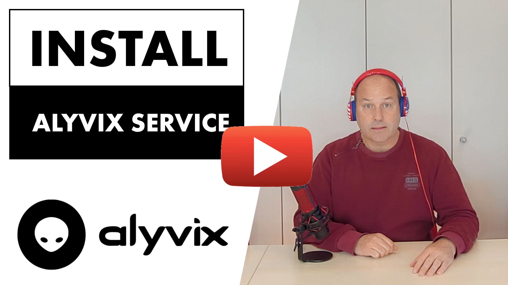

:author: Charles Callaway
:date: 27-07-2021
:modified: 27-07-2022
:tags: videos, tutorials
:lang: en-US
:translation: false
:status: draft

.. include:: sphinx-roles.txt

.. _video_tutorials_top:

###############
Video Tutorials
###############

The Alyvix Service video tutorials below can provide a complementary learning style to the
written user guide.  You will also find here videos describing the business case for Alyvix
Service in your organization as well as implemented use cases for specific scenarios.

.. _video_tutorials_install_alyvix_service:

.. rubric:: Installing Alyvix Service

The video version of the [installation instructions](https://alyvix.com/learn/server/install.html)
in this user guide, showing you how to install Alyvix Service on a Windows machine to create
an Alyvix Node.

|source-youtube|

|

.. _video_tutorials_outlook_web:

.. rubric:: Installing the Alyvix-NetEye module

Here we lay out the reasons why you should use Synthetic Monitoring to keep tabs on the performance
of your Outlook clients.  The video describes the IT benefits of using Alyvix Service in an implemented
use case at an IT company that extensively uses Microsoft's email, calendar and contacts
application to keep its employees and customers communicating smoothly.

|source-youtube|

|

.. _video_tutorials_enable_test_case:

.. rubric:: Enable Alyvix test cases in NetEye

This video shows you how to put a working Alyvix test case in the configured
test case directory, add it to a session on an Alyvix Node, enable it to run
at regular intervals, and then check one of the reports generated after each run.

.. image:: pictures/videos/video-cover-03-200.png
   :class: image-boxshadow image-very-large
   :alt: Enable an Alyvix test case in NetEye, version 2.0.0
   :target: https://youtu.be/8sH1AWTOQxo

|source-youtube|

|

.. _video_tutorials_lifecycle_rdc:

.. rubric:: Build and run an Alyvix RDC test case in NetEye

This video takes a look at the entire Alyvix Service lifecycle when it's used together with a
monitoring system and focused on checking remote applications.  We build a complete test case
from scratch that uses Remote Desktop (RDC) to log in to a remote server, run an application
there, and receive and review reports that include timing data and screenshots of each
measured task step.

.. image:: pictures/videos/video-cover-04-200.png
   :class: image-boxshadow image-very-large
   :alt: Alyvix RDC test case in NetEye, version 2.0.0
   :target: https://youtu.be/C3GiaQoyhCQ

|source-youtube|

.. _video_tutorials_monitor_app_gui:

.. rubric:: Visually monitor your app GUI with Alyvix

Inevitably one day your users or customers will try to use their services or apps on your
servers and will find them unavailable.  That's why we have monitoring in IT:  to minimize
disruptions as much as possible.  But if you rely only on traditional, hardware-based
monitoring, you'll still miss many service interruptions because an important app isn't
responding even though the hardware is working normally.

Visual Monitoring, which is what Alyvix and Alyvix Service provide, work together to
monitor your app's GUI just like a monitoring system runs hardware checks:  Every few
minutes, 24/7, Alyvix Service pretends to be a user trying to run specific tasks in the
same app your users work with.  And just like traditional monitoring, it delivers reports
and historical data that you can use to diagnose specific problems with your apps,
and even to help foresee service interruptions before they can affect your users.

.. image:: pictures/videos/video-cover-05-230.png
   :class: image-boxshadow image-very-large
   :alt: Monitoring lifecycle with Alyvix, version 2.3.0
   :target: https://youtu.be/aTyxldL7pN4

|source-youtube|

.. _video_tutorials_monitor_vpn:

.. rubric:: Remotely monitor your VPN with Alyvix

Having problems knowing when your workers can't connect to the company VPN?  If your internal
monitoring says the VPN is fine, but your users say it's not, then it's probably time to give
remote visual monitoring a try.  Alyvix Service and Alyvix let you use your existing
monitoring tools to see when users are having problems, and even fix them before they notice.

|source-youtube|
